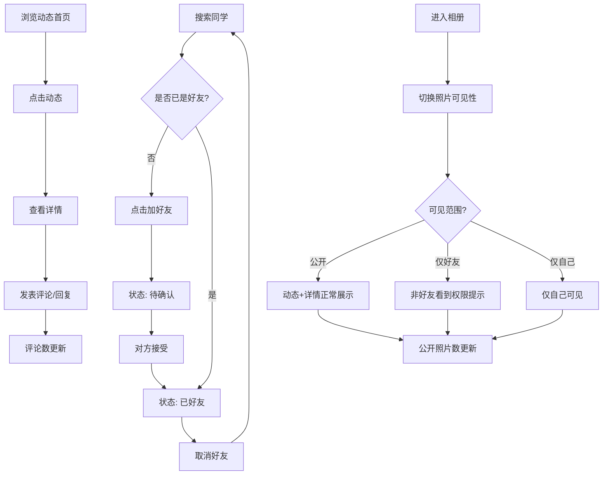

## 1. 产品概述

一个仿早期校内网（人人网）风格的校园社交原型应用，以本地 Mock 数据驱动，围绕"同学关系-动态-相册-评论"构建核心社交闭环。目标用户为校园场景下的学生群体，首版聚焦于好友关系管理与内容互动的完整操作链路。

- 以高信息密度的老校园社交风格还原经典校内网体验
- 所有数据本地化，无需后端即可完整操作好友申请、动态浏览、评论回复、相册权限切换等功能

## 2. 核心功能

### 2.1 用户角色

| 角色 | 说明 | 核心权限 |
|------|------|----------|
| 当前登录用户 | 系统内置的"我" | 搜索同学、发起/取消好友、发动态、评论回复、管理相册可见性 |
| 同学/好友 | Mock 数据中的其他用户 | 出现在同学列表、动态作者、评论者等场景 |

### 2.2 功能模块

1. **动态首页**：展示好友和公开动态流，含照片缩略图，可跳转详情
2. **同学/好友列表**：搜索同学、发起加好友、取消好友，状态实时反馈
3. **动态详情页**：查看完整动态内容、发表评论、回复评论
4. **个人相册**：浏览照片、切换可见范围（公开/仅好友/仅自己），权限变更即时联动
5. **统计面板**：好友数、待处理请求、公开照片数、评论数等，随操作实时变化

### 2.3 页面详情

| 页面名称 | 模块名称 | 功能描述 |
|----------|----------|----------|
| 动态首页 | 动态流 | 展示好友动态和公开动态，含文字+照片，可跳转详情 |
| 动态首页 | 统计卡片 | 展示好友数、待处理请求、公开照片数、评论数 |
| 同学列表 | 搜索栏 | 按姓名搜索同学 |
| 同学列表 | 同学卡片 | 显示头像、姓名、好友状态按钮（加好友/已好友/待确认/取消） |
| 动态详情 | 动态内容 | 完整展示动态文字和照片 |
| 动态详情 | 评论区 | 评论列表+回复列表+发表评论+回复评论 |
| 动态详情 | 权限提示 | 根据照片可见性显示权限提示标签 |
| 个人相册 | 照片网格 | 照片缩略图网格，每张显示可见性标签 |
| 个人相册 | 可见性切换 | 下拉切换"公开/仅好友/仅自己"，切换后动态和详情页联动 |

## 3. 核心流程

**好友关系流程**：用户搜索同学 → 点击加好友 → 状态变为"待确认" → 对方接受后变为"已好友" → 可取消好友恢复为同学关系。好友状态影响动态流可见范围和相册可见性。

**动态浏览流程**：首页浏览动态流 → 点击动态进入详情 → 在详情中发表评论或回复 → 评论数实时更新统计面板。

**相册权限流程**：进入相册 → 切换某张照片可见性 → 若设为"仅好友"则非好友在动态/详情中看到权限提示 → 若设为"仅自己"则仅自己在相册中可见 → 统计面板公开照片数实时更新。

## 4. 用户界面设计

### 4.1 设计风格

- **主色调**：深蓝 #1B3A5C（经典校内网深蓝）搭配白色背景，辅以浅蓝 #4A7FB5 作为链接和高亮色
- **强调色**：橙红 #E8533F 用于通知/待处理徽标，绿色 #4CAF50 用于好友状态确认
- **按钮风格**：圆角 4px，好友操作按钮采用实心填充，取消操作为描边样式
- **字体**：标题用 "Noto Serif SC" 衬线体还原学术氛围，正文用 "Noto Sans SC" 无衬线体
- **布局**：左侧固定导航栏（桌面端）+ 顶部导航（移动端），中央内容区域，右侧信息面板
- **信息密度**：紧凑排列，列表项高度适中，头像 36px，文字 14px 为主，类似 2008-2010 年校内网风格
- **装饰元素**：顶部深蓝横幅、阴影卡片、圆角头像、竖线分隔符

### 4.2 页面设计概述

| 页面名称 | 模块名称 | UI 元素 |
|----------|----------|---------|
| 全局布局 | 左侧导航 | 深蓝背景，白色图标+文字，活跃项浅蓝高亮，底部统计卡片 |
| 全局布局 | 顶部横幅 | 深蓝渐变背景，Logo 文字"同学录"，右侧通知图标+待处理徽标 |
| 动态首页 | 动态流 | 白色卡片列表，左侧头像+右侧内容区，照片缩略图 120x90，底部评论数/时间 |
| 动态首页 | 统计卡片 | 右侧面板，4 个统计数字，带图标，数值动态更新 |
| 同学列表 | 搜索栏 | 顶部搜索输入框，蓝色描边 |
| 同学列表 | 同学卡片 | 横向列表项：头像+姓名+好友状态按钮+简介 |
| 动态详情 | 详情卡片 | 大卡片布局，完整照片展示（最大 600px 宽），权限标签（彩色圆角标签） |
| 动态详情 | 评论区 | 卡片式评论列表，每条评论下方缩进回复，底部评论输入框 |
| 个人相册 | 照片网格 | 4 列网格，每张照片底部叠加可见性标签，hover 显示切换按钮 |

### 4.3 响应式设计

- 桌面端优先（≥1024px）：左侧固定导航 + 中央内容 + 右侧面板
- 平板（768-1023px）：导航折叠为顶部，右侧面板移至底部
- 移动端（<768px）：底部标签导航，单列布局

### 4.4 3D 场景说明

不涉及 3D 场景
