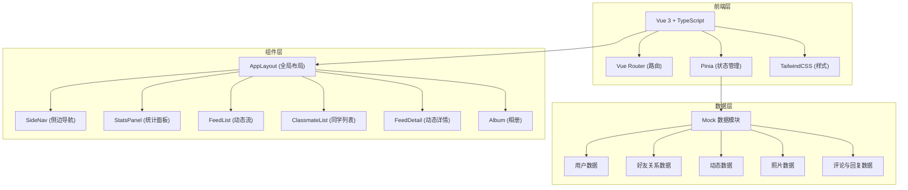
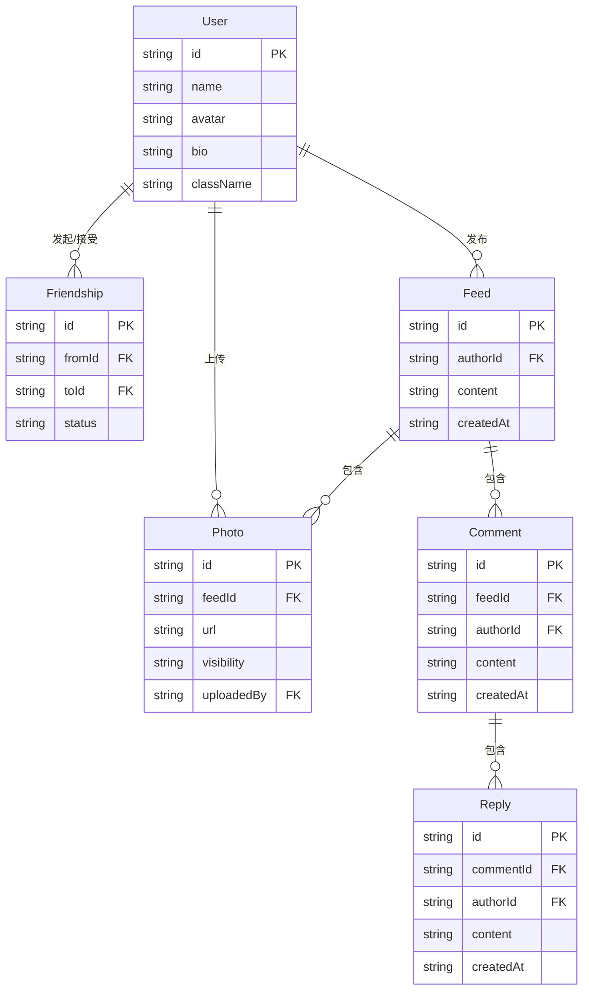

## 1. 架构设计



## 2. 技术说明

- **前端框架**：Vue 3 + TypeScript + Vite
- **初始化工具**：vite-init (vue-ts 模板)
- **状态管理**：Pinia（轻量 Vue 3 官方推荐）
- **路由**：Vue Router 4
- **样式方案**：TailwindCSS 3
- **后端**：无，纯前端本地 Mock
- **数据存储**：本地 reactive 数据，Pinia store 管理

## 3. 路由定义

| 路由 | 用途 |
|------|------|
| `/` | 动态首页，展示动态流和统计面板 |
| `/classmates` | 同学/好友列表，搜索和好友管理 |
| `/feed/:id` | 动态详情页，含评论回复区 |
| `/album` | 个人相册，含可见性管理 |

## 4. API 定义

无后端 API，所有数据操作通过 Pinia Store 方法完成：

```typescript
// 好友操作
addFriend(userId: string): void      // 发起加好友请求
acceptFriend(userId: string): void   // 接受好友请求
removeFriend(userId: string): void   // 取消好友关系

// 评论操作
addComment(feedId: string, content: string): void       // 添加评论
addReply(commentId: string, content: string): void      // 添加回复

// 相册操作
updatePhotoVisibility(photoId: string, visibility: Visibility): void  // 切换照片可见性

// 查询操作
searchClassmates(keyword: string): User[]               // 搜索同学
getFeedDetail(feedId: string): FeedDetail | null         // 获取动态详情
getVisiblePhotos(userId: string): Photo[]                // 获取可见照片
```

## 5. 服务端架构

无后端服务

## 6. 数据模型

### 6.1 数据模型定义



### 6.2 数据定义

```typescript
// 可见性枚举
type Visibility = 'public' | 'friends' | 'self'

// 好友关系状态
type FriendshipStatus = 'pending' | 'accepted'

// 用户
interface User {
  id: string
  name: string
  avatar: string
  bio: string
  className: string
}

// 好友关系
interface Friendship {
  id: string
  fromId: string
  toId: string
  status: FriendshipStatus
}

// 动态
interface Feed {
  id: string
  authorId: string
  content: string
  createdAt: string
}

// 照片
interface Photo {
  id: string
  feedId: string
  url: string
  visibility: Visibility
  uploadedBy: string
}

// 评论
interface Comment {
  id: string
  feedId: string
  authorId: string
  content: string
  createdAt: string
}

// 回复
interface Reply {
  id: string
  commentId: string
  authorId: string
  content: string
  createdAt: string
}
```
